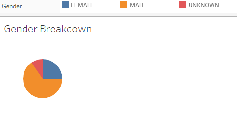
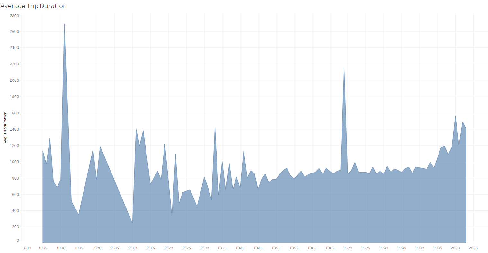
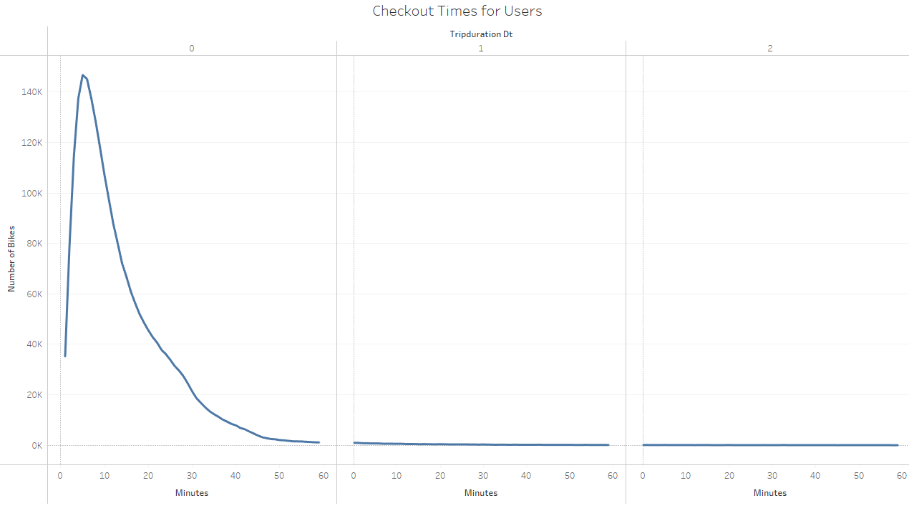
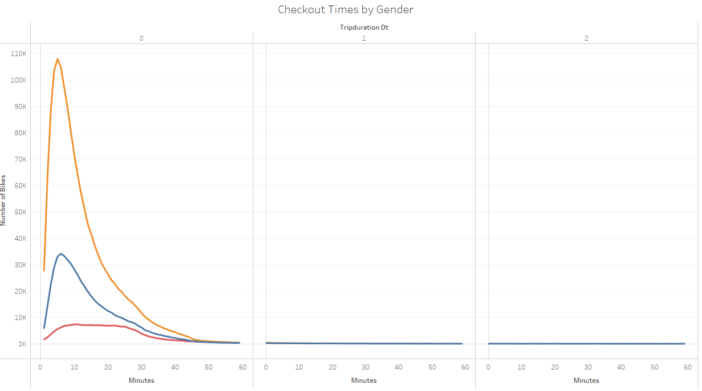
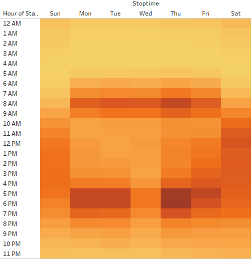
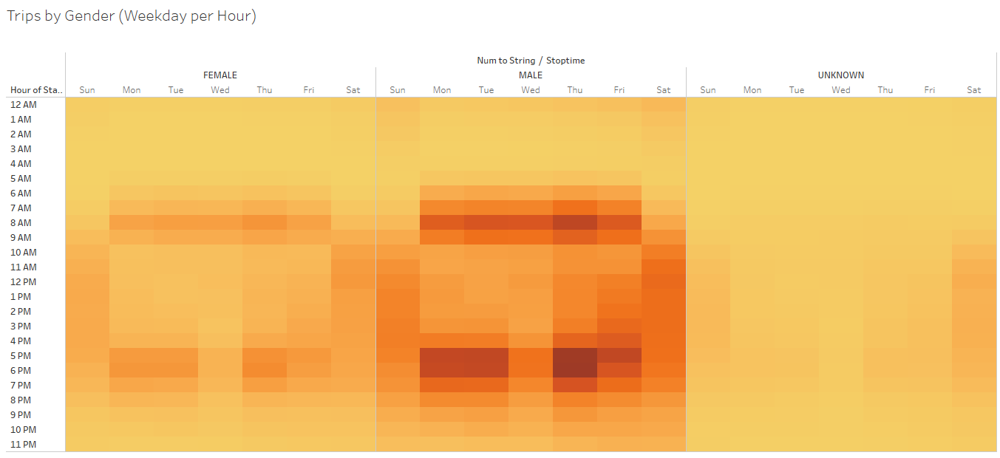
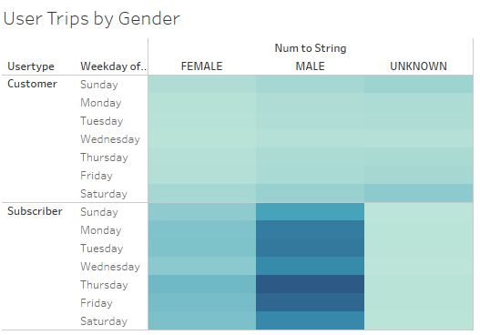

# NYC Bikeshare Analysis

## Contents
- [Overview of the Project](#overview)
- [Files and Tableau Link](#files-and-tableau-link)
- [Results](#data-analysis-results)
- [Summary](#summary)

## Overview
The purpose of this analysis is to showcase additional data that may convince potential investors about the viability of a bikeshare program in Des Moines. For this putpose, several visuals were created in Tableau using the NYC Citibike data.

## Files and Tableau Link
- NYC_CitiBike_Challenge.ipynb - Contains the code to convert trip duration to a datetime format
- 201908-citibike-tripdata.csv - Updated csv file with raw data and trip duration in datetime format
- [Tableau Link](https://public.tableau.com/app/profile/deepak.chakravarthy/viz/citi_challenge/NYCStory?publish=yes)

## Data Analysis Results

### Gender Breakdown
The image below shows that over 2/3 of the bikesahre users are males.

### Average Trip Duration
Trip duration increases with decrease in age as shown by the image below.

### Checkout Times
Image below shows that majority of the bike checkout times are less than 20 minutes. 

### Checkout Times by Gender
Image below shows that while fewer women checkout bikes, their check out times are comparable to men.

### Weekday Trips
Image below shows that weekday evenings between 5 and 6 are the most popular times for bike checkouts. Weekday mornings around 8 also see higher checkouts.

### Weekday Trips
Not surprisingly, men checkout more than women.

### User Trips
Male subscribers checkout the most number of bikes.

### Summary
Following is a high level summary of the analysis:
1. Men dominate the bikeshare industry in NYC.
2. Majority of the checkouts happen on weekday mornings and early evenings.
3. Subscribers are more likely to checkout bikes compared to ad hoc users.

### Additional Visualizations
While the analysis is interesting, it provides no insight into how the bikeshare program would perform in Des Moines. A whole new demographic and geographical analysis needs to be performed to make a decision on investing in the program in Des Moines. However, here are two other visualizations that will provide additional insight into the NYC Citibike program:
1. Checkout times by birth year would indicate if mature riders are more likely to checkout bikes for longer leisurely rides. This might play into the demographics of Des Moines.
2. User type by Birth Year would also provide more insight into the age group that is willing to subscribe for the bikeshare program.